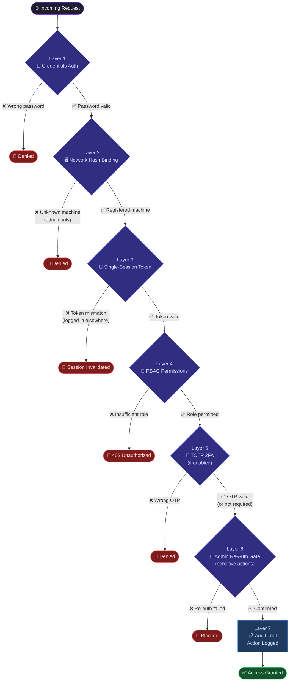

```mermaid
flowchart TD
    ROOT(["🗂️ AWP-ABCD_WORK_PLATFORM"])

    ROOT --> SRC["📁 src/"]
    ROOT --> PRISMA["📁 prisma/"]
    ROOT --> ENV["📄 .env.example"]
    ROOT --> README["📄 README.md"]

    SRC --> APP["📁 app/"]
    SRC --> COMP["📁 components/\nShared UI"]
    SRC --> LIB["📁 lib/"]

    APP --> ADMIN["📁 admin/\n🛡️ Admin Dashboard"]
    APP --> POS["📁 pos/\n🧾 POS Terminal"]
    APP --> LOGIN["📁 login/\n🔑 Unified Login"]
    APP --> API["📁 api/"]

    ADMIN --> JOBS["📁 jobs/\nJob Templates"]
    ADMIN --> MEMBERS["📁 members/\nMember CRUD"]
    ADMIN --> SETTINGS["📁 settings/\nLAN Config + Audit"]
    ADMIN --> ADMINS["📁 admins/\nAdmin Accounts"]

    API --> TXN["📁 transaction/\n💳 Billing + TX ID"]
    API --> DISCOVER["📁 member/discover/\n📡 LAN Discovery"]
    API --> SYSTEM["📁 system/\n⚙️ Bootstrap · TOTP · Audit"]

    LIB --> AUTH["🔐 auth.ts\nNextAuth + Network Hash"]
    LIB --> ROLES["👥 roles.ts\nRBAC Permissions"]
    LIB --> AUDIT["📋 audit.ts\nAudit Logger"]
    LIB --> IDENTITY["🖥️ identity.ts\nMachine Fingerprint"]
    LIB --> TOTP["📱 totp.ts\n2FA Verification"]
    LIB --> EMAIL["📧 email.ts\nSMTP Transporter"]
    LIB --> RECOVERY["🔄 recovery.ts\nPassword Recovery"]

    PRISMA --> SCHEMA["📄 schema.prisma\nDatabase Schema"]
    PRISMA --> SEED["📄 seed.ts\nInitial Data Seed"]

    style ROOT fill:#1e1e2e,stroke:#7c3aed,color:#e2e8f0,stroke-width:2px
    style SRC fill:#1e293b,stroke:#3b82f6,color:#93c5fd
    style APP fill:#1e293b,stroke:#3b82f6,color:#93c5fd
    style LIB fill:#1e293b,stroke:#3b82f6,color:#93c5fd
    style COMP fill:#1e293b,stroke:#3b82f6,color:#93c5fd
    style PRISMA fill:#1e293b,stroke:#10b981,color:#6ee7b7
    style ADMIN fill:#312e81,stroke:#818cf8,color:#c7d2fe
    style POS fill:#312e81,stroke:#818cf8,color:#c7d2fe
    style LOGIN fill:#312e81,stroke:#818cf8,color:#c7d2fe
    style API fill:#312e81,stroke:#818cf8,color:#c7d2fe
    style JOBS fill:#1f2937,stroke:#6b7280,color:#d1d5db
    style MEMBERS fill:#1f2937,stroke:#6b7280,color:#d1d5db
    style SETTINGS fill:#1f2937,stroke:#6b7280,color:#d1d5db
    style ADMINS fill:#1f2937,stroke:#6b7280,color:#d1d5db
    style TXN fill:#1f2937,stroke:#6b7280,color:#d1d5db
    style DISCOVER fill:#1f2937,stroke:#6b7280,color:#d1d5db
    style SYSTEM fill:#1f2937,stroke:#6b7280,color:#d1d5db
    style AUTH fill:#7f1d1d,stroke:#f87171,color:#fecaca
    style ROLES fill:#7f1d1d,stroke:#f87171,color:#fecaca
    style AUDIT fill:#7f1d1d,stroke:#f87171,color:#fecaca
    style IDENTITY fill:#7f1d1d,stroke:#f87171,color:#fecaca
    style TOTP fill:#7f1d1d,stroke:#f87171,color:#fecaca
    style EMAIL fill:#7f1d1d,stroke:#f87171,color:#fecaca
    style RECOVERY fill:#7f1d1d,stroke:#f87171,color:#fecaca
    style SCHEMA fill:#14532d,stroke:#4ade80,color:#bbf7d0
    style SEED fill:#14532d,stroke:#4ade80,color:#bbf7d0
    style ENV fill:#1c1917,stroke:#a8a29e,color:#d6d3d1
    style README fill:#1c1917,stroke:#a8a29e,color:#d6d3d1
```

<div align="center">

<br />

```
    ___    ____  ____  ____     _       ______  ____  __ __      ____  _       ___  ______ ____  ___  ____  __  __ 
   /   \  |    ||    ||    \   | |     /      ||    ||  |  |    |    \| |     /   \|      |    ||   \/   ||    \|  ||  |
  |     |  |  |  |  | |  o  )  | |    |      | |  | |  |  |    |  o  ) |    |     |      ||  | |  \_/  ||  _  |  ||  |
  |  A  |  |  |  |  | |   _/  | |___ |      | |  | |  _  |    |   _/| |___ |  O  |_|  |_||  | |  \_/  ||  |  |  ||__|
  |  _  |  |  |  |  | |  |    |     ||  --  | |  | |  |  |    |  |  |     ||     | |  |  |  | |  |  |  ||  |  |  | __ 
  | | | |  |  |  |  | |  |    |     ||      | |  | |  |  |    |  |  |     ||     | |  |  |  | |  |  |  ||  |  |  ||  |
  |_| |_| |____||____||__|    |_____||______||____||__|__|    |__|  |_____| \___/ |__| |____||___/|__|  |__|  |____||__|
```

<br/>

# ABCD Work Platform

**A secure, offline-first POS and workforce management system built for local networks.**
Built with Next.js 16 · React 19 · SQLite · Electron · shadcn/ui

<br/>

[](https://nextjs.org/)
[](https://react.dev/)
[](https://www.typescriptlang.org/)
[](https://www.prisma.io/)
[](https://www.sqlite.org/)
[](https://www.electronjs.org/)
[](/)
[](/)

<br/>

</div>

---

## 📋 Overview

**ABCD Work Platform (AWP)** is a production-grade desktop application for small businesses that need a fast, reliable POS terminal with full admin oversight — all running **offline on your local network**, with no cloud dependency.

The system is split into two roles:
- **Admin** — manages members, jobs, pricing, and monitors analytics from a centralized dashboard
- **Member (POS Staff)** — uses the billing terminal to process customer orders and generate receipts

All data lives on the **admin's machine**. Members connect over LAN and have billing rights only.

---

## ✨ Features

<table>
<tr>
<td width="50%">

### 🖥️ Admin Panel
- Full member lifecycle management (create, reset, delete)
- Job template CRUD with category + pricing options
- Real-time analytics: revenue, member share, top jobs
- LAN IP configuration for member discovery
- On-demand security audit log (zero background polling)
- Bootstrap wizard for first-time setup

</td>
<td width="50%">

### 🧾 POS Terminal
- Bento-grid job selector with option toggles
- Smart cart with quantity control and localStorage persistence
- UPI QR code generation for contactless payment
- Cash / UPI payment mode switching
- Itemized digital receipt on checkout
- Stale-cart auto-cleanup (removed templates discarded)

</td>
</tr>
<tr>
<td>

### 🔐 Security
- Network hash binding — admin locked to registered machine
- Single-session enforcement — one device per account
- Admin re-auth before sensitive actions (delete/reset)
- TOTP 2FA for admin accounts
- JWT session token rotation on every login

</td>
<td>

### 🔢 Transaction System
- Structured IDs: `AAAA HH MM SS DD MM YY ORDER#`
- Atomic daily counter — zero collision under concurrent billing
- Full audit trail on every transaction
- Member-scoped authorization enforced server-side

</td>
</tr>
</table>

---

## 🛠️ Tech Stack

| Category | Technology |
|---|---|
| Framework | Next.js 16 (App Router, Server Components, Route Handlers) |
| UI Library | shadcn/ui + Tremor + Framer Motion |
| Auth | NextAuth.js v4 — Credentials provider + JWT |
| Database | SQLite (via Prisma ORM 5) |
| Forms | React Hook Form + Zod validation |
| Tables | TanStack Table v8 |
| Desktop | Electron (self-contained NSIS installer) |
| Styling | Tailwind CSS v4 |
| Notifications | Sonner toast |
| Email | Nodemailer (SMTP — for admin password recovery) |
| 2FA | otplib (TOTP) + QR code |

---

## 🚀 Getting Started

### Prerequisites

- Node.js 20+
- npm 10+

### Installation

### Quick Start (Windows)

**Simply double-click:** `RUN_APPLICATION.bat`

The batch file automatically handles setup and starts the server.

### Manual Setup (All Platforms)

```bash
# 1. Clone the repository
git clone https://github.com/const-ayush57/AWP-ABCD_WORK_PLATFORM.git
cd AWP-ABCD_WORK_PLATFORM

# 2. Install dependencies
npm install

# 3. Set up environment variables
copy .env.example .env
#  → Edit .env and set only NEXTAUTH_SECRET (leave UPI ID empty)

# 4. Initialize the database
npx prisma db push
npx prisma db seed

# 5. Start the development server
npm run dev
```

### First Launch Checklist

1. **Open in browser:** `http://localhost:3000`
2. **Complete Admin Bootstrap Wizard** to create your master admin account (no default credentials)
3. **Log in** with the account you just created
4. **Go to Admin Settings** and add your **Billing UPI ID** (e.g., `8447436163@ybl`)
   - This will be used automatically for member POS billing QR codes
   - **No need to edit .env** — all UPI configuration happens in Admin Settings
5. **Configure host IP and port** if accessing from member devices on the LAN

> To access from member devices on the same network, use `http://<your-LAN-ip>:3000`.

---

## ⚙️ Environment Variables

Copy `.env.example` to `.env` and configure:

```env
# Database
DATABASE_URL="file:./prisma/awp.db"

# NextAuth (generate secret: node -e "console.log(require('crypto').randomBytes(32).toString('base64'))")
NEXTAUTH_SECRET="<your-strong-secret>"
NEXTAUTH_URL="http://localhost:3000"

# UPI fallback (optional; primary configuration happens in Admin Settings after first login)
# Leave empty — UPI is managed via Admin Settings > Billing UPI ID
NEXT_PUBLIC_ADMIN_UPI=""

# SMTP — optional, enables admin email recovery
SMTP_HOST=smtp.gmail.com
SMTP_PORT=587
SMTP_USER=your-email@example.com
SMTP_PASS=your-app-password
SMTP_FROM=noreply@example.com
```

> ⚠️ **Never commit your `.env` file.** It is blocked by `.gitignore`.

---





---

## 🖥️ Desktop Build (Electron)

To produce a self-contained Windows installer:

```bash
npm run package:win
```

The build pipeline handles everything automatically:
1. Downloads a bundled Node.js runtime
2. Generates Prisma client
3. Pushes schema and seeds the database
4. Builds Next.js in production mode
5. Packages into an NSIS installer

**Output:** `dist/ABCD Work Platform Setup 1.0.5.exe`

End users install once and launch — no Node.js or manual setup required.

After first admin login, open `Admin -> Settings` and configure:
- Server Host and Port (for LAN member access)
- **Billing UPI ID** — Configure once here, automatically used for all member POS billing QR codes. Members do not need to set this up individually.

---

## 🔒 Security Architecture




---

## 📸 Screenshots

> *Add screenshots here once the app is deployed or packaged.*

| Admin Dashboard | POS Terminal | Analytics |
|---|---|---|
| *(screenshot)* | *(screenshot)* | *(screenshot)* |

---

## 📜 npm Scripts

| Script | Description |
|---|---|
| `npm run dev` | Start dev server on `0.0.0.0:3000` (LAN accessible) |
| `npm run build` | Build Next.js for production |
| `npm run lint` | Run ESLint |
| `npx prisma db push` | Sync Prisma schema to SQLite |
| `npx prisma db seed` | Seed initial data |
| `npm run smtp:test` | Test SMTP configuration |
| `npm run package:win` | Build Windows installer |

---

## 🤝 Contributing

This is a private project. For changes or bug reports, please open an issue or contact the maintainer directly.

---

<div align="center">

Built with ❤️ · Next.js · Prisma · Electron

**[⬆ Back to top](#abcd-work-platform)**

</div>
