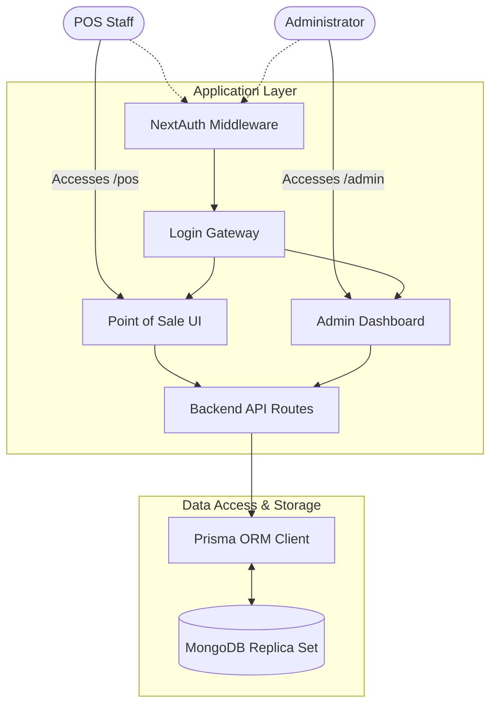

# CyberTrack POS

CyberTrack POS is a modern, full-stack Point of Sale (POS) and management platform designed explicitly for local networked environments. It serves dual roles: a Kiosk-style interface for local staff (Members) to log transactions seamlessly via Zero-Cost UPI QR codes, and a secured Dashboard for Administrators to manage available jobs, track live metrics, and manage personnel.

## Features

- **RBAC Security Layers:** Role-Based Access Control physically segregates `ADMIN` users from `MEMBER` users via Next.js Middleware. Staff cannot navigate into the admin configuration panels.
- **Dynamic Job Calculator:** Configure "Job Templates" (e.g., Printing) with mapped "Job Options" (e.g., Double Sided +₹5). The POS frontend mathematically maps these options live on-screen for exact base + extra cost structures.
- **Zero-Cost QR Payment Trigger:** Transactions securely parse global UPI handles to locally render a precise `upi://pay` URI on the screen directly through `qrcode.react`, avoiding third-party gateway fees.
- **Traceable Receipt Generation:** Transactions statically record custom receipt IDs (e.g., `NIH-20260304-X8F2`) binding the member's profile initials, the physical date, and a secure random hex to every single layout.
- **Top Performer Analytics:** Calculates live, real-time metrics inside the Admin Dashboard using Prisma aggregations (`groupBy`) to determine which exact staff member has brought in the most revenue over the course of the day.

## System Architecture

This project is built using a modern full-stack web architecture with the following core technologies:

- **Frontend:** Next.js 15 (App Router). Client Components are strictly used for interactivity while Server Components natively handle strict data-fetching.
- **Styling:** Tailwind CSS combined with `shadcn/ui` for rapid, responsive component design.
- **Backend Environment:** Next.js Route Handlers (`/api`) and internal React Server Actions.
- **Authentication System:** NextAuth.js utilizing a custom Credentials Provider mapped to bcrypt password hashes.
- **Database / ORM:** MongoDB Replica Sets communicating securely through the Prisma Client for highly typed queries.



## Getting Started

First, ensure your local MongoDB instance is active. Configure your `.env` securely:
```env
DATABASE_URL="mongodb://localhost:27017/cybertrack"
NEXTAUTH_URL="http://localhost:3000"
NEXTAUTH_SECRET="your_unique_secure_string_here"
NEXT_PUBLIC_ADMIN_UPI="your_bank_upi_here"
```

1. Deploy the initial schemas: `npx prisma db push`
2. Run the server locally: `npm run dev` (it natively broadcasts out on `0.0.0.0` for local access).
3. Connect your devices locally, log into the `/admin` portal, set up your Jobs and Members, and deploy to your floor!
